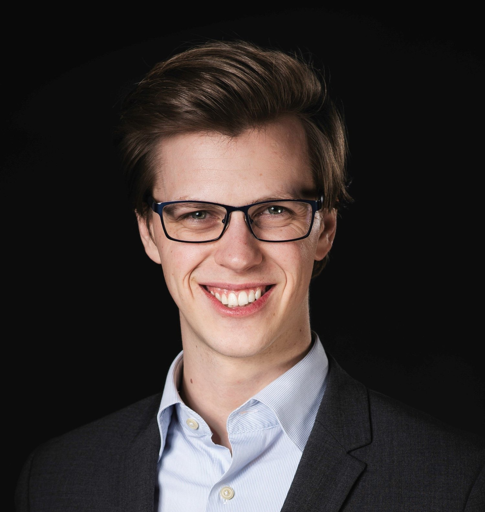

::: {.profile}
{.profile-photo fig-alt="Hans Fredrik Sunde"}

::: {.profile-body}
# Hans Fredrik Sunde

I am [a postdoctoral researcher](https://www.fhi.no/en/more/research-centres/Centre-for-fertility-and-health/employees/hans-fredrik-sunde/)
at the Centre for Fertility and Health, Norwegian Institute of Public Health,
where I work on a project called PARMENT – Parenthood, childlessness, and mental
health in times of falling fertility.

I primarily investigate causes and consequences of partner similarity (such as
assortative mating), and its consequences for social differences, mental health,
and genetic methodology. I also investigate associations between social
differences and mental health across generations, attempting to differentiate
selection and causation. My interests include behavioral genetics, psychology,
statistics, philosophy of science, and methodological issues in social science.

I have a PhD in psychology, which I attained when I defended my dissertation
*Reproduction of socioeconomic differences and mental health across generations*
the spring of 2024 at the University of Oslo's (UiO) Department of Psychology.
Previously, I have a master's degree in psychology from the Norwegian University
of Science and Technology (NTNU), which specialized on learning; brain, behavior
and environment.

Follow me on BlueSky ([@hfsunde.bsky.social](https://bsky.app/profile/hfsunde.bsky.social)),
[LinkedIn](https://www.linkedin.com/in/hansfredriksunde/), and the other place
([@hfsunde](https://twitter.com/hfsunde)).
:::
:::

## Selected papers

```{r}
#| results: asis
source("R/publications.R")
cat(selected_html(read_selected(), read_publications()))
```

[See all publications](publications.qmd){.more-link}
